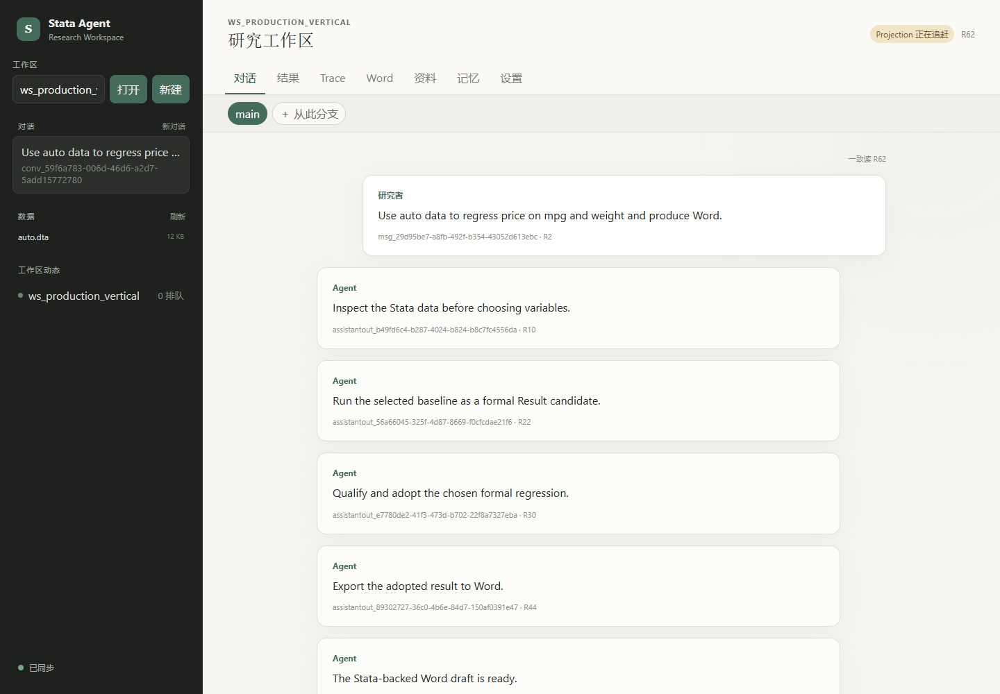

# Stata Research Agent

A local-first research workspace for moving from an empirical idea and data to a controllable,
traceable, and reproducible Stata research process. The Agent can work autonomously, but the
researcher remains the final decision-maker: a Turn can pause for review, every adopted number is
backed by a reproducible Stata execution, and alternative research paths can branch without
destroying the original history.



## What is implemented

- A bounded Agent loop with planning, tool use, evaluation checkpoints, waiting, pause, recovery,
  and explicit stop decisions.
- Parallel execution across Workspaces, with a single write lane and stable execution scope inside
  each Workspace.
- Stata MCP integration for data inspection, estimation, result capture, tables, figures, and Word
  delivery; Python and shell remain exploratory tools and cannot silently become formal statistical
  evidence.
- Versioned Research Paths, Plans, Data Versions, Results, Evidence records, document revisions,
  artifacts, and current-adoption pointers.
- A raw Interaction Journal plus readable Trace views, so a reported result can be traced back to
  its Stata run, command instance, do-file, input data, and artifacts.
- Research RAG for literature, Stata help, and chapter-specific writing examples, including query
  rewriting, hybrid retrieval, reranking, multi-hop retrieval, and explicit insufficient-evidence
  behavior.
- Workspace memory with progressive recall, provenance, confidence, supersession, forgetting, and
  controlled Skill-evolution proposals.
- A browser workspace for Conversation, Results, Trace, Word, Knowledge, Memory, Settings, and
  research-path branching.

The service binds only to an authenticated random loopback port. Provider credentials are stored in
Windows Credential Manager; SQLite stores versioned credential references rather than API keys.

## Runtime shape

```text
Browser UI / Local API
        |
Workspace -> Conversation -> Turn -> Step -> Model Invocation
                                      |             |
                                      |             +-> Research Agent
                                      +-> Tool Call -> Admission -> Operation
                                                           |
                              Stata MCP / File / Python / Shell / RAG
                                                           |
                         Journal -> Result -> Evidence -> Word
```

## Start the product locally

Requirements: Windows 11, Python 3.12, Node.js/npm, `uv`, and Stata 18+ for real statistical runs.
Install dependencies, build the same-origin browser client, verify the runtime, then start the
service:

```powershell
uv sync --dev
npm --prefix web ci
npm --prefix web run build
uv run stata-research-agent --probe
uv run stata-research-agent
```

The service binds an authenticated random loopback port and opens the browser. A second launch
connects to the existing instance instead of starting another writer. Workspaces default to
`Documents\Stata Research Agent`; use `--workspace-root` to select another parent directory.

From the browser, create or select a Workspace, choose its Provider/model and permission mode in
Settings, start a Conversation, attach a dataset path, and submit the research idea. “Deliver Word”
adds a required document obligation; the ordinary research-loop mode can stop earlier or ask for a
decision. A Waiting Turn retains its write lane but keeps Workspace inspection available.

### Runtime usage and optional cost projection

Each Conversation exposes a lazy-loaded Turn usage card backed by authoritative Provider Attempt,
Tool Operation, and Turn Budget facts. Token quality and monetary quality are reported separately;
missing usage or pricing is shown as `unknown`, never as zero. Local Stata/Python execution reports
duration only and is not assigned a fictional dollar cost.

Monetary projection is optional. The service reads
`%LOCALAPPDATA%\StataResearchAgent\control\provider-pricing.json` at startup when present:

```json
{
  "schema_version": "1",
  "pricing_revision": "local-prices-2026-09",
  "currency": "USD",
  "profiles": [
    {
      "provider_profile": "deepseek",
      "input_per_million": "0.27",
      "output_per_million": "1.10",
      "cached_input_per_million": "0.07"
    }
  ]
}
```

Rates are strings per one million tokens. The report always includes the loaded price revision and
remains an operational estimate rather than Research Evidence or a Provider bill.

### Continuous evaluation from ordinary research use

Evaluation does not require a separate benchmark mode. Every ordinary Turn leaves authoritative
Context, model, Tool, Stata, Result, Evidence, Word, control and usage facts. The read-only
evaluation API derives three explainable layers from those facts:

- `GET /api/v1/workspaces/{workspace_id}/turns/{turn_id}/evaluation`
- `GET /api/v1/workspaces/{workspace_id}/evaluation`
- `POST /api/v1/workspaces/{workspace_id}/turns/{turn_id}/outcome-feedback`

L1 covers subsystems, L2 covers the complete Agent loop and efficiency, and L3 covers product
outcomes such as Stata provenance, replay readiness, Word delivery, researcher-control boundaries
and explicit user adoption/revision signals. Metrics retain numerator, denominator, source tables,
policy revision and the model/Skill/Tool configuration slice. Missing denominators are
`not_applicable`; open quality observations are not converted into invented accuracy scores.

For local trend export, point the scanner at the real Workspace host root and label the cohort:

```powershell
uv run python tools/run_operational_evaluation.py `
  "$env:USERPROFILE\Documents\Stata Research Agent" `
  --scope-kind ordinary_product_use `
  --cohort-label "local ordinary use" `
  --output operational-evaluation.json
```

Fixed scenarios and public-paper replications remain auxiliary release regression and failure
injection tools; they are not the source of routine product metrics.

### Optional local RAG model packs

Lexical retrieval and pypdf parsing are always available. Local dense retrieval and selective
MinerU enrichment are activated only when pinned adapters are configured; ordinary PDF pages are
never sent through full-document OCR by default:

```powershell
$env:SRA_EMBEDDING_MODEL = "intfloat/multilingual-e5-small"
$env:SRA_EMBEDDING_REVISION = "614241f622f53c4eeff9890bdc4f31cfecc418b3"
$env:SRA_EMBEDDING_CACHE = "D:\models\huggingface"
$env:SRA_MINERU_EXECUTABLE = "D:\tools\mineru\mineru.exe"
$env:SRA_MINERU_VERSION = "4.x-pinned"
uv run stata-research-agent
```

The equivalent command-line flags are `--embedding-model`, `--embedding-revision`,
`--embedding-cache`, `--mineru-executable`, and `--mineru-version`. A MinerU failure keeps the
complete pypdf parse and records a degraded page finding. A later parse failure also never replaces
an already indexed last-known-good source.

## Local verification

```powershell
.venv\Scripts\python.exe -m pytest -q
npm --prefix web run build
uv run stata-research-agent --probe
```

## Windows packaging rehearsal

The current installer path is deliberately labelled `local-unsigned`: it is a per-user
development rehearsal, not a signed production release. It installs under
`%LOCALAPPDATA%\Programs\StataResearchAgent`, does not add a service or modify `PATH`, and its
uninstaller does not delete research Workspaces or application control data.

```powershell
uv run python tools/build_local_candidate.py `
  --output .candidate-stage/local-0.0.2 --release-id local-0.0.2
uv run python tools/verify_local_candidate.py `
  --candidate .candidate-stage/local-0.0.2 `
  --stata-home "C:\Program Files\Stata18" `
  --report .candidate-stage/local-0.0.2/evidence/candidate-verification-report.json
uv run python tools/build_local_installer.py `
  --candidate .candidate-stage/local-0.0.2 `
  --verification-report .candidate-stage/local-0.0.2/evidence/candidate-verification-report.json `
  --output .installer-stage/local-0.0.2
```

Inno Setup 6 is required only for the final command. The candidate verifier and installed
rehearsal verifier both execute a real Stata 18 regression and an `esttab` RTF export.

## Real stability stress

The stress runner starts isolated Stata sessions for at least two Workspaces and repeatedly
captures a regression, RTF table, DTA, and graph. Every Completion Manifest and Artifact hash/size
is checked and the run writes `stress-report.json`.

```powershell
uv run python tools/run_real_product_stress.py `
  --output-root .stress-runs/local-0.0.2 `
  --cycles 20 --workspaces 2 `
  --candidate .candidate-stage/local-0.0.2
```

`tools/run_live_product_e2e.py` is the separately budgeted live-model gate. It enforces a wall
clock ceiling, token ceilings, terminal Provider/Operation state, Stata Result/Evidence lineage,
Word Artifact integrity, and an exact API-key persistence scan.

The static suite also enforces the domain boundary: framework, database, provider, document, and
adapter dependencies cannot leak into `domain`.
