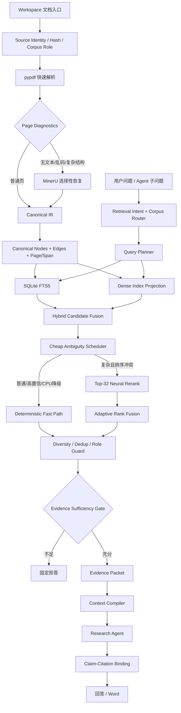

# Stata Research Agent RAG Runtime Architecture

## 1. 目标

RAG 不是独立问答插件，而是 Research Agent 的研究知识输入层。它必须同时满足：

1. 论文、Stata Help、写作范例三类语料严格隔离；
2. 能检索普通段落，也能处理公式、表格、跨页和多跳问题；
3. 模型只基于实际取回的证据回答，查不到时稳定拒答；
4. 每个引用可定位到 Source Revision、Canonical Node、页码和 Retrieval Hop；
5. 默认本地运行，模型缺失、GPU 不可用或重排失败时可降级；
6. Parser、Embedding、Reranker、Vector Backend 均可替换，但不得建立第二权威账本。

## 2. 总体结构



SQLite 中的 Source、Parse Revision、Node、Retrieval Session/Hop、Candidate、Selection、
Evidence Packet 和 Context Use 是权威事实。FTS、Dense Index、缓存和 Span 都是可删除重建的
Projection 或 Diagnostics。

## 3. 文档进入系统

### 3.1 Intake 与语料角色

新文档先登记稳定身份、来源位置、内容 hash、大小、解析 revision 和 Corpus Role：

```text
literature_evidence  -> 可支持研究事实与引用
stata_help           -> 只支持命令、选项、返回值和报错诊断
style_exemplar       -> 只支持文风 few-shot，不得支持事实
project_memory       -> 只支持历史决策导航，不得支持研究事实
```

Corpus Role 在检索前过滤，而不是在生成后补救。跨角色搜索必须由 Agent 显式发起多个查询，
不能把写作范例误当论文证据。

### 3.2 分层解析

默认采用：

```text
pypdf 全文快速抽取
-> 页级文本/乱码/结构诊断
-> 仅对失败页或关键公式/表格页调用 MinerU
-> 统一映射到 Canonical IR
```

普通文本不做全文 OCR。Rich Parser 失败时保留 pypdf 结果和失败诊断，不丢失整篇文档。

### 3.3 Canonical Node

系统按文档结构保存标题、段落、表格、公式、图注、脚注和参考文献节点，并保留 contains、
next、previous、references 等关系。长节点可以在索引层切成检索片段，但每个片段必须能回到：

```text
source_revision_id
parse_revision_id
canonical_node_id
page_start / page_end
span / table / formula locator
```

## 4. Query 与 Agentic Retrieval

### 4.1 Query Planner

原始问题永远保留。Planner 可以生成关键词化查询、研究目标查询和公开的多跳子问题；每个变体
记录 reason code 和 planner revision。普通问题使用确定性改写，只有模糊、比较、机制、冲突或
证据缺口明显时才允许模型生成新子问题。

### 4.2 多跳循环

```text
检索一跳
-> 查看 novel evidence 与未解决证据槽
-> 若证据链未闭合，生成下一条 public_subquestion
-> 在同一 Retrieval Session 继续
-> 证据充分、无新证据或预算到达时停止
```

模型可以决定研究问题需要几跳，但不能伪造 Hop。HyDE 若未来启用，只能生成查询，不得进入
Evidence Packet。

## 5. Hybrid Retrieval 与融合重排

### 5.1 第一阶段召回

FTS5 负责原词、Stata 命令、变量、估计量和报错文本；multilingual-E5-small 负责跨语言和语义
召回。两路候选通过 rank fusion 合并，并保留 lexical rank、dense rank、dense score、query
variant ordinals 和 index revision。

### 5.2 自适应调度

调度器只计算便宜特征：

- 第一、第二候选的归一化分差；
- 确定性相关度置信；
- FTS 与 Dense 的 rank disagreement；
- 查询长度以及比较、机制、因果等复杂性信号；
- 证据是否已经低到应直接拒答。

默认仅在以下条件同时成立时触发神经重排：

```text
复杂查询
AND 第一阶段分差小
AND (词法/向量排序明显冲突 OR 确定性置信不足)
```

明显证据不足的查询不会调用更昂贵的重排模型“抢救”，而是交给 Evidence Sufficiency Gate。

### 5.3 融合而不是替换

神经模型不直接覆盖第一阶段分数。不同 Reranker 的 logit 不具有统一概率含义，因此先转成
query 内 rank percentile，再融合：

```text
neural_component = 0.70 * neural_rank_percentile
                 + 0.30 * sigmoid(neural_logit)

final_score = 0.55 * neural_component
            + 0.25 * deterministic_relevance
            + 0.20 * first_stage_rank_prior
```

模型负责语义判断；确定性信号负责原词、目标覆盖和稳定先验；最终再执行去重、来源多样性、
Corpus Role 和证据身份等硬约束。规则不判断“哪种研究方法正确”。

### 5.4 已采用模型档位

| Runtime Profile | Embedding | Reranker | 用途 |
| --- | --- | --- | --- |
| offline/degraded | FTS5 | deterministic | 无模型包或模型异常 |
| CPU balanced | E5-small | deterministic | 默认无独显设备 |
| GPU balanced | E5-small | adaptive `bge-reranker-base` | 当前综合质量/成本最优 |
| GPU quality | Qwen3-Embedding-0.6B | adaptive / deterministic | 用户主动选择高质量档 |

`bge-reranker-base` 仅重排 Top 32，输入上限 512 token。CPU 上观察到的开销过高，因此 CPU
不默认启用神经重排。模型不可用或推理异常时，同一查询自动回退到 deterministic fast path。

## 6. 查不到就拒答

拒答不是 Prompt 建议，而是独立的 Retrieval-to-Generation 边界：

```text
Selected Evidence
-> Evidence Sufficiency Gate
-> supported / insufficient_evidence
```

Gate 至少检查候选存在性、相关度边界、relevance label、Corpus Role、证据槽覆盖和是否存在更新的
矛盾观察。多跳问题还要检查每个 required evidence group 是否闭合。

当状态为 `insufficient_evidence`：

```text
answer_allowed = false
claims = []
固定输出 = 未在当前知识库中找到足够证据，无法回答。
```

Agent 常识、模型记忆、Style Exemplar、Project Memory 和未被选中的候选都不能绕过此边界。
模型生成后还需执行 Claim-Citation Binding；引用不存在、角色不合法或正文不支持 Claim 时，回答
不得进入正式消息或 Word。

## 7. Context 装配

Evidence Packet 只包含本次回答需要的最小节点，并带完整引用身份。Context Compiler 将当前任务、
研究状态、用户消息、检索证据和外部记忆引用分层装配；全文与历史材料留在外部文件系统，需要时
按 ID 打开，不用摘要改写权威原文。

同一 Node 在一个 Model Invocation 中只注入一次。工具结果过大时保留结构化索引、局部窗口和
Artifact 引用，而不是把整篇论文重复塞入上下文。

## 8. Trace 与版本

每次检索应能回答：

```text
用户问了什么
Planner 生成了哪些 Query Variant
FTS / Dense 各召回了什么
为什么触发或跳过 Reranker
使用了哪个模型 revision、权重和阈值
哪些候选被去重或因角色被拒绝
Sufficiency Gate 为什么允许回答或拒答
最终 Claim 引用了哪些 Node/Page
```

Retrieval Hop 保存权威候选和选择事实；模型耗时、GPU 使用和 span 属于非权威 Diagnostics。
模型、阈值或融合权重改变时创建新 policy revision，不回写历史 Hop。

## 9. 失败与降级

| 失败 | 行为 |
| --- | --- |
| Dense 模型/索引不可用 | FTS5 + deterministic |
| Reranker 未安装 | deterministic fast path |
| Reranker 单次异常 | 同一查询回退，不丢候选 |
| MinerU 失败 | pypdf fallback + 解析诊断 |
| 多跳没有新证据 | 结束 Session，进入拒答判断 |
| 引用校验失败 | 不交付 Claim，要求重检索或固定拒答 |
| 模型包 revision 不匹配 | 拒绝载入，不静默使用最新版 |

## 10. 真实评测结果

30 篇公司金融论文、1,511 页、10,124 个 Node、41 个问题的冻结评测得到：

| Variant | MRR | Marker Recall | Multi-hop | No-answer | Mean Query |
| --- | ---: | ---: | ---: | ---: | ---: |
| E5 + deterministic | 0.962 | 0.986 | 0.917 | - | paired 0.541 s |
| BGE v2-m3 replace | 0.949 | 1.000 | 1.000 | - | 2.137 s |
| BGE v2-m3 adaptive fusion | 0.976 | 1.000 | 1.000 | 1.000 | 1.413 s |
| MiniLM adaptive fusion | 0.959 | 1.000 | 1.000 | 1.000 | 0.653 s |
| **BGE base adaptive fusion** | **0.977** | **1.000** | **1.000** | **1.000** | paired 0.876 s |

GPU balanced profile在 3 次、每次 47 条查询的同进程交替测量中触发神经重排约 51.4%，平均增加
0.335 秒，P95 增加 0.794 秒。10 个 Case 的 Top-1 发生变化，3 个 Case 的 MRR 或证据覆盖改善，
没有观察到 Case 指标退化；5 个 no-answer 全部拒答，36 个正题误拒率为 0%。

这些数字只说明当前冻结语料与题集。调度阈值、权重和模型采用仍需通过日常线上评测持续观察，
不得把一次 bake-off 写成永久架构常量。

## 11. 部署配置

生产 Composition Root 已支持可选模型包：

```text
SRA_EMBEDDING_MODEL
SRA_EMBEDDING_REVISION
SRA_EMBEDDING_CACHE
SRA_RERANKER_MODEL
SRA_RERANKER_REVISION
SRA_RERANKER_CACHE
SRA_RERANKER_DEVICE
```

所有模型必须固定 revision，缓存位于用户配置的数据盘。没有显式配置 Reranker 时，产品使用
deterministic fallback，不会假装神经重排已启用。

## 12. 后续门槛

在扩大默认能力前继续验证：

- 真实用户问题上的 useful / harmful rerank rate；
- Citation Precision、Claim Coverage、Faithfulness 和拒答误差；
- Stata Help 精确检索与错误修复成功率；
- 10k / 50k / 100k / 250k Node 压力；
- 多 Workspace 并发和模型共享；
- ONNX / OpenVINO 量化与原 PyTorch 排序等价性；
- 文献新增、索引增量更新和模型 revision 迁移。
